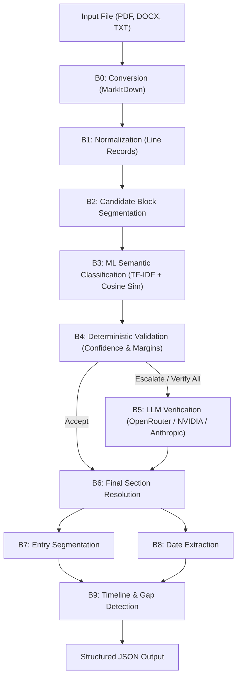

# Architecture Documentation: ML + Deterministic Resume Pipeline

This document details the multi-stage architecture ($B_0 \rightarrow B_9$) of the Resume Parser system.

---

## Pipeline Stages

### $B_0$: Conversion (`conversion.py`)
- Ingests PDF, DOCX, TXT, or HTML using `markitdown`.
- Tracks document SHA-256 hash, conversion timestamp, and character count.
- Emits typed warnings without throwing fatal exceptions on minor extraction issues.

### $B_1$: Normalization (`normalization.py`)
- Segments converted markdown into lines.
- Creates immutable `LineRecord`s (`L000000`, `L000001`, ...) tracking `raw_text`, `normalized_text`, character offsets, and line kind (HEADING, BULLET, TEXT, BLANK).
- Guarantee: Raw text is never altered or lost; non-destructive.

### $B_2$: Segmentation (`segmentation.py`)
- Groups consecutive lines into structural candidate blocks (`CandidateBlock`).
- Identifies page breaks, bullet lists, markdown headings, and repeated boilerplate lines (headers/footers).
- Assigns deterministic `block_id`s (`B000000`, `B000001`, ...).

### $B_3$: ML Classification (`classification.py`)
- Vectorizes blocks using TF-IDF n-grams (1-2 words).
- Predicts semantic sections (`contact`, `summary`, `experience`, `education`, `skills`, `projects`, `certifications`, `awards`, `languages`, etc.) using calibrated LogisticRegression.
- Computes **cosine similarity** between block TF-IDF vectors and prototypical schema section vectors.
- Maps predicted sections to the Resume-Matcher target schema.

### $B_4$: Validation (`validation.py`)
- Purely deterministic verification:
  - Minimum confidence threshold (default 0.50).
  - Margin threshold between top-1 and top-2 predictions (default 0.15).
  - Mixed-span check (detects blocks spanning multiple sections).
  - Singleton section constraints (ensures only one contact/summary block unless verified).
- Verdict: `ACCEPT` or `ESCALATE` (which triggers $B_5$).

### $B_5$: LLM Verification (`resolution.py`)
- Dispatches blocks to an external LLM for expert arbitration.
- Supported providers:
  - **OpenRouter** (`OpenRouterLLMClient`): Supports `nvidia/nemotron-3-ultra-550b-a55b` with configured reasoning parameters and fallback parsing.
  - **NVIDIA NIM** (`NvidiaNIMLLMClient`): Direct integration with hosted NVIDIA NIM models.
  - **Anthropic** (`AnthropicLLMClient`): Direct integration with Claude models.
- Returns structured JSON confirming or correcting section assignments with rationale.

### $B_6$: Final Sections (`final_sections.py`)
- Merges $B_4$ verdicts and $B_5$ resolutions into `FinalBlockSection`s.
- Sets `trusted: True` for accepted ML blocks and confirmed/corrected LLM blocks.
- Marks untrusted blocks explicitly without dropping text.

### $B_7$: Entry Segmentation (`entries.py`)
- Breaks multi-job or multi-degree blocks into distinct `ResumeEntry` records.
- Identifies job boundaries using job title hints and company patterns.

### $B_8$: Date Extraction (`date_extraction.py`)
- Extracts calendar ranges (e.g. `2011 - 2016`, `02/2024 - 08/2025`, `Present`).
- Normalizes start/end years and months into ISO formats.

### $B_9$: Timeline & Gap Detection (`timeline.py`)
- Constructs chronological employment history.
- Calculates tenure lengths and identifies gaps between roles exceeding 90 days.

---

## Integrity and Provenance Guarantees
- **Line Coverage**: Every meaningful non-blank line is tracked. Missing lines or duplicate assignments are reported in `lineCoveragePercent` and `missingLineIds`.
- **Zero Hallucination**: Content text is extracted directly from the original document; the ML model and LLM only predict and verify metadata labels.
